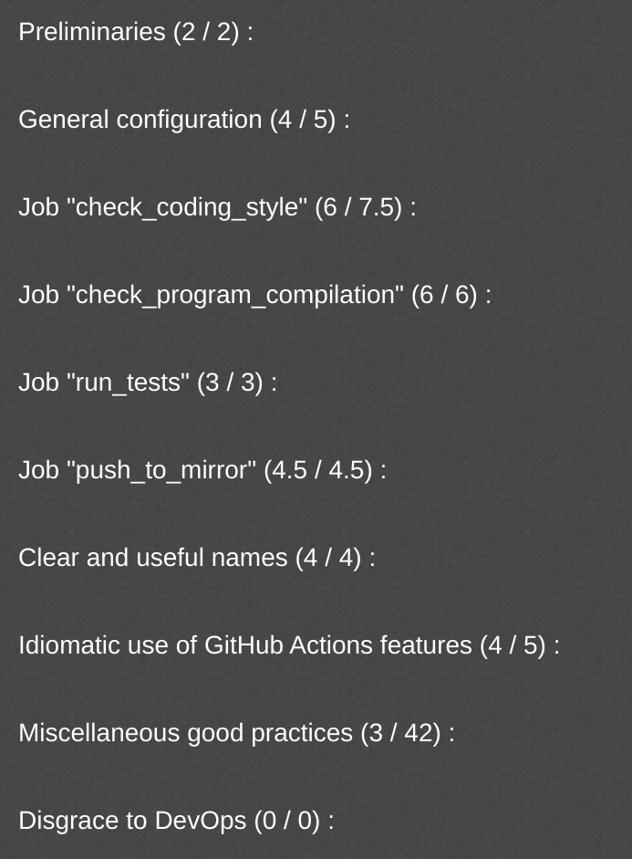

# Chocolatine ~ Epitech GitHub Actions Project
DevOps module final grade: A

# How to run the project
Add the yml file into an existing project and push to github.

# Description
Introduction project to learn github action.

What we had to do:
  - 4 jobs:
      -  Check the coding style of the project
      -  Check program compilation
      -  Run tests
      -  Push to a mirror repository

# Final evaluation

# Repo structure
In order to test if I completed correctly the tasks, I added my project to an existing project with the following structure

